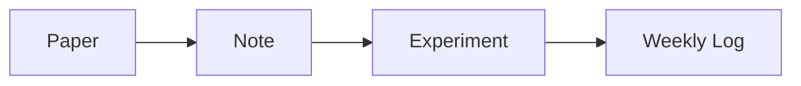

# Research Brain

A Next.js 15 portfolio for documenting Oshadha Samarakoon's contribution toward EE405 - Undergraduate Project I, including weekly logs, technical notes, literature review records, resources, and project write-ups.

## Stack

- Next.js 15 App Router, TypeScript, TailwindCSS, shadcn-style primitives
- Framer Motion route transitions
- MDX with GFM, KaTeX, citations, callouts, collapsibles, embeds, code blocks, and PDF embeds
- Decap CMS at `/admin`
- GitHub backend and Vercel-ready deployment

## Content Model

The site is intentionally small at the top level:

- `/` graph overview and latest research activity
- `/weekly-logs` auto-aggregated weekly research timeline
- `/notes` unified notes database for research, math, deep learning, course, programming, systems, book, and experiment notes
- `/papers` paper archive with PDF, highlights, annotations, concepts, datasets, and implementation ideas
- `/blog` polished essays
- `/resources` datasets, tools, templates, and references
- `/fyp` live research roadmap synthesized from the graph

Content lives in `content/**` as MDX. Use frontmatter fields such as `links`, `related`, `notes`, `papers`, and `experiments` to create backlinks and graph edges.

## Local Development

```bash
npm install
npm run dev
```

Open `http://localhost:3000`.

For Decap local authoring:

```bash
npx decap-server
```

Then open `http://localhost:3000/admin`.

## GitHub and Decap Setup

Edit `public/admin/config.yml`:

```yaml
backend:
  name: github
  repo: Oshadha345/FYP1
  branch: main
  base_url: https://fyp-1-ten.vercel.app
  auth_endpoint: api/auth
```

Create a GitHub OAuth app for the built-in Decap auth routes.

Use these GitHub OAuth app values:

```text
Homepage URL:
https://fyp-1-ten.vercel.app

Authorization callback URL:
https://fyp-1-ten.vercel.app/api/callback
```

Then set these Vercel environment variables:

```text
OAUTH_CLIENT_ID=<GitHub OAuth Client ID>
OAUTH_CLIENT_SECRET=<GitHub OAuth Client Secret>
```

`/admin` remains the CMS entry point served by Vercel. Only GitHub users with write access to `Oshadha345/FYP1` can publish changes.

## Vercel Deployment

1. Push this repository to GitHub.
2. Import the repo in Vercel.
3. Use the default Next.js build command: `npm run build`.
4. Configure the Decap OAuth proxy URL in `public/admin/config.yml`.
5. CMS edits commit MDX to GitHub; Vercel rebuilds automatically.

## Authoring

Use Decap CMS to create notes, papers, weekly logs, essays, and resources without editing source code. Upload images, PDFs, videos, and files through the CMS. Write equations directly in MDX:

```mdx
$$
L_{IB} = I(Z;Y) - \beta I(Z;X)
$$
```

Mermaid diagrams render from normal fenced code blocks:

````mdx

````

Link pages by slug:

```yaml
links:
  - information-bottleneck-fyp
  - papers/calibration-modern-neural-networks
```
