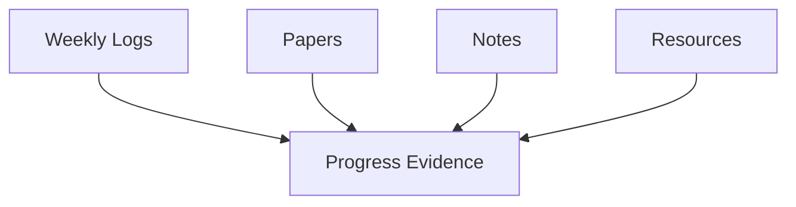

This portfolio is organized into a few simple sections:

> [!TIP]
> Each entry should explain what was done, why it matters, and how it supports the FYP.

A simple way to think about progress is:

$$
P = C + R + E
$$

where $C$ is completed work, $R$ is reviewed literature, and $E$ is experiment evidence.
