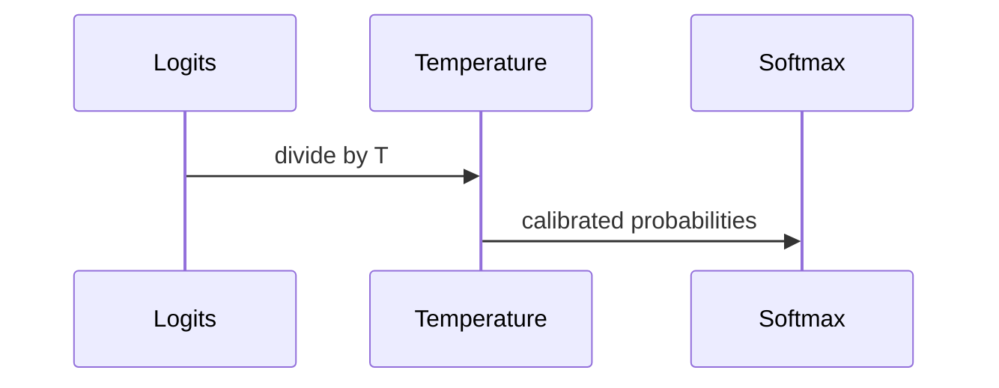

## Core Claim

Modern networks can be accurate while poorly calibrated [@guo2017].

The post-hoc scaling objective is:

$$
\hat{q}_i = \max_k \sigma(z_i / T)^{(k)}
$$

```bibtex
@inproceedings{guo2017calibration,
  title={On Calibration of Modern Neural Networks},
  author={Guo, Chuan and Pleiss, Geoff and Sun, Yu and Weinberger, Kilian Q.},
  booktitle={International Conference on Machine Learning},
  year={2017}
}
```


