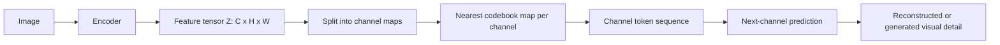

## Core Idea

Traditional image tokenizers usually split a feature tensor into local patch tokens. CVQ changes the axis of tokenization: each channel map becomes the unit being quantized. This means the token sequence describes levels or types of visual detail across channels instead of a grid of local image patches.

## Working Formulation

Let an encoder produce a feature tensor:

$$
Z = f_\theta(x) \in \mathbb{R}^{C \times H \times W}
$$

For channel \(c\), the channel map is:

$$
z_c = Z[c,:,:] \in \mathbb{R}^{H \times W}
$$

With a channel-wise codebook:

$$
\mathcal{E} = \{e_1, e_2, \ldots, e_K\}, \quad e_k \in \mathbb{R}^{H \times W}
$$

the quantized token index is:

$$
t_c = \arg\min_{k \in \{1,\ldots,K\}} \lVert z_c - e_k \rVert_2^2
$$

and the quantized channel is:

$$
\hat{z}_c = e_{t_c}
$$

This is the key conceptual shift: the nearest-neighbor lookup compares full channel maps, not isolated patch vectors.

## Deep Dive for Beginners

The easiest way to understand CVQ is to ignore large images for a moment and use a tiny feature tensor.

Assume an encoder converts one image into:

$$
Z \in \mathbb{R}^{3 \times 2 \times 2}
$$

That means the feature has 3 channels, and each channel is a small \(2 \times 2\) map.

$$
z_1 =
\begin{bmatrix}
0.9 & 0.8 \\
0.1 & 0.0
\end{bmatrix},
\quad
z_2 =
\begin{bmatrix}
0.2 & 0.2 \\
0.8 & 0.9
\end{bmatrix},
\quad
z_3 =
\begin{bmatrix}
0.5 & 0.5 \\
0.5 & 0.4
\end{bmatrix}
$$

Now define a very small channel-wise codebook:

$$
e_1 =
\begin{bmatrix}
1 & 1 \\
0 & 0
\end{bmatrix},
\quad
e_2 =
\begin{bmatrix}
0 & 0 \\
1 & 1
\end{bmatrix},
\quad
e_3 =
\begin{bmatrix}
0.5 & 0.5 \\
0.5 & 0.5
\end{bmatrix}
$$

You can think of these as three learned patterns:

| Codebook entry | Simple meaning |
| --- | --- |
| \(e_1\) | top-heavy activation |
| \(e_2\) | bottom-heavy activation |
| \(e_3\) | smooth or uniform activation |

CVQ compares each full channel map with every codebook entry.

For channel 1:

$$
\lVert z_1 - e_1 \rVert_F^2
= (0.9-1)^2 + (0.8-1)^2 + (0.1-0)^2 + (0.0-0)^2
= 0.06
$$

The other distances are larger:

$$
\lVert z_1 - e_2 \rVert_F^2 = 3.26,
\quad
\lVert z_1 - e_3 \rVert_F^2 = 0.66
$$

So channel 1 receives token \(1\).

Repeating the same nearest-neighbor lookup:

| Channel | Closest codebook pattern | Token |
| --- | --- | --- |
| \(z_1\) | \(e_1\), top-heavy | 1 |
| \(z_2\) | \(e_2\), bottom-heavy | 2 |
| \(z_3\) | \(e_3\), smooth | 3 |

The image is now represented as a short channel-token sequence:

$$
[1, 2, 3]
$$

This is the beginner-level intuition: CVQ says, "This image feature is made of a top-heavy pattern, then a bottom-heavy pattern, then a smooth pattern."

## How This Differs From Patch-wise VQ

Patch-wise VQ would look at each spatial position and build vectors across channels:

$$
Z[:,1,1] = [0.9, 0.2, 0.5],
\quad
Z[:,1,2] = [0.8, 0.2, 0.5],
$$

$$
Z[:,2,1] = [0.1, 0.8, 0.5],
\quad
Z[:,2,2] = [0.0, 0.9, 0.4]
$$

So patch-wise VQ would generate 4 spatial tokens for this tiny example. CVQ generates 3 channel tokens.

| Method | Token unit | Toy output |
| --- | --- | --- |
| Patch-wise VQ | one token per spatial location | 4 patch tokens |
| CVQ | one token per feature channel | 3 channel tokens |

The CVQ paper argues that this change of axis matters because image patches can be repetitive. Many similar patches may repeatedly select the same few codebook entries, causing poor codebook usage. Channel maps are often more separable, so more codebook entries can receive updates.

## Quantization and Gradients

Nearest-neighbor lookup is discrete:

$$
t_c = \arg\min_k \lVert z_c - e_k \rVert_F^2
$$

The selected codebook entry becomes the quantized channel:

$$
z_{q,c} = e_{t_c}
$$

During training, the paper follows the usual vector-quantization pattern: the forward pass uses the discrete codebook entry, while the backward pass uses a straight-through estimator so the encoder can still receive gradients.

One compact way to write the straight-through form is:

$$
z_{q,c} = z_c + \operatorname{sg}(e_{t_c} - z_c)
$$

where \(\operatorname{sg}(\cdot)\) means stop-gradient.

## What the Paper Reports

The important reported result is not only reconstruction quality. The paper emphasizes codebook usage. In its ImageNet tokenizer experiments, conventional VQ can use only a small fraction of a large codebook, while CVQ maintains near-full usage across large codebooks.

For a beginner, the practical meaning is:

| Problem | Why CVQ helps |
| --- | --- |
| Dead codebook entries | Channel-wise features are less repetitive than many local patches. |
| Artificial 2D-to-1D ordering | Channels already form a 1D token sequence. |
| Autoregressive generation | CAR can predict the next channel token instead of the next raster-scanned patch. |

## Channel-wise Prediction View

The paper also introduces a channel-wise auto-regressive direction. In public notation, the channel token sequence can be modeled as:

$$
p(t_{1:C}\mid y) = \prod_{c=1}^{C} p(t_c \mid t_{<c}, y)
$$

where \(y\) can be a conditioning signal such as text. The training objective is the usual negative log-likelihood over channel tokens:

$$
\mathcal{L}_{CAR} = -\sum_{c=1}^{C}\log p_\phi(t_c \mid t_{<c}, y)
$$

## Diagram



## Why I Read This

CVQ is useful for thinking about visual representations because it asks a different question from patch tokenization. Instead of only asking what local region a token represents, it asks whether a whole feature channel can be treated as a coherent visual pattern.

This is a public paper note only. It does not describe any internal FYP architecture.

## BibTeX

```bibtex
@misc{song2026channelwisevectorquantization,
      title={Channel-wise Vector Quantization}, 
      author={Wei Song and Tianhang Wang and Yitong Chen and Tong Zhang and Zuxuan Wu and Ming Li and Jiaqi Wang and Kaicheng Yu},
      year={2026},
      eprint={2605.26089},
      archivePrefix={arXiv},
      primaryClass={cs.CV},
      url={https://arxiv.org/abs/2605.26089}, 
}
```
