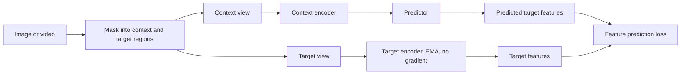
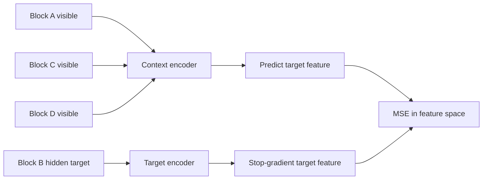
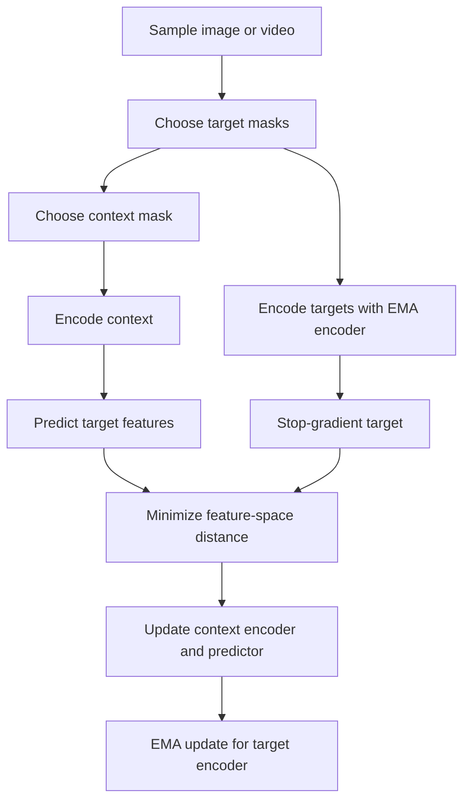

## Public Scope

This note summarizes JEPA as a public learning direction. It does not describe the private FYP model architecture or unpublished experiment results.

## Basic JEPA Pattern

JEPA learns by predicting missing information in representation space instead of reconstructing pixels. A context encoder sees visible parts of an input, a target encoder produces target representations, and a predictor learns to match those target representations.



## General Loss Objective

Let \(x_c\) be the visible context and \(x_t\) be a target region. The context branch produces:

$$
h_c = f_\theta(x_c)
$$

The target branch produces a stop-gradient target representation:

$$
h_t = \operatorname{sg}(f_{\bar{\theta}}(x_t))
$$

The predictor estimates the target representation from the context:

$$
\hat{h}_t = g_\phi(h_c, m_c, m_t)
$$

A common JEPA-style feature loss is:

$$
\mathcal{L}_{JEPA}
= \frac{1}{K}\sum_{k=1}^{K}
\left\lVert
\operatorname{norm}(\hat{h}_{t,k})
-
\operatorname{norm}(h_{t,k})
\right\rVert_2^2
$$

The target encoder is typically updated with an exponential moving average:

$$
\bar{\theta} \leftarrow \tau\bar{\theta} + (1-\tau)\theta
$$

## Deep Dive for Beginners

The simplest way to understand JEPA is to compare it with an ordinary reconstruction task.

| Method | What the model predicts |
| --- | --- |
| Pixel reconstruction | missing pixels |
| JEPA | missing feature representations |

JEPA does not ask the model to redraw every pixel. It asks the model to predict the meaning of a missing region in feature space.

Imagine an image is divided into four blocks:



The context encoder sees Blocks A, C, and D. The target encoder sees Block B. The predictor must guess the feature representation of Block B using the visible context.

## Numerical Example

Use a tiny feature vector so the math is clear.

Assume the target encoder produces this feature for the hidden block:

$$
h_t = [0.60, 0.80]
$$

The context encoder and predictor produce:

$$
\hat{h}_t = [0.50, 0.70]
$$

For this toy example, use plain mean squared error:

$$
\mathcal{L}
= \frac{(0.50-0.60)^2 + (0.70-0.80)^2}{2}
$$

$$
\mathcal{L}
= \frac{0.01 + 0.01}{2}
= 0.01
$$

If there are two target blocks, average their losses:

| Target block | Target feature | Prediction | Loss |
| --- | --- | --- | --- |
| Block B | \([0.60, 0.80]\) | \([0.50, 0.70]\) | 0.0100 |
| Block E | \([0.10, 0.90]\) | \([0.20, 0.70]\) | 0.0250 |

$$
\mathcal{L}_{total}
= \frac{0.0100 + 0.0250}{2}
= 0.0175
$$

This is the core JEPA training signal: make predicted latent features close to target latent features.

## EMA Target Encoder Example

The target encoder should move slowly so the target does not change too abruptly. That is why JEPA-style systems often use an exponential moving average update.

Suppose one target-encoder weight is currently:

$$
\bar{\theta} = 10
$$

and the matching context-encoder weight after training is:

$$
\theta = 14
$$

With \(\tau = 0.9\):

$$
\bar{\theta}_{new}
= 0.9(10) + 0.1(14)
= 10.4
$$

So the target encoder moves from 10 to 10.4, not all the way to 14. This slow-moving target helps stabilize the feature-prediction task.

## Why Masking Matters

If the target is too small, the task may become low-level and easy. If the context is too weak, the task may become impossible. I-JEPA emphasizes a useful balance: target blocks should be large enough to carry semantic information, while the context should be spatially informative enough to predict them.

For a beginner:

| Masking choice | Likely behavior |
| --- | --- |
| Tiny missing patches | model may learn local texture shortcuts |
| Very large missing region with poor context | prediction becomes unstable or vague |
| meaningful target block and distributed context | model is encouraged to learn semantic structure |

## Paper-Level Comparison

| Paper | Input type | Prediction target | Important point |
| --- | --- | --- | --- |
| I-JEPA | Image | Target block features | Predicts missing image-block representations from context blocks. |
| V-JEPA | Video | Target video-region features | Extends feature prediction to motion and appearance in videos. |
| V-JEPA 2 | Video/world-model setting | Latent future or masked features | Connects self-supervised video representation learning with understanding and prediction. |

## Training Paradigm



## Why It Matters for This FYP

Change detection depends on useful visual representations before the final change mask is predicted. JEPA is relevant because it focuses on learning meaningful latent structure without forcing pixel-level reconstruction. For this public site, the important takeaway is conceptual: representation prediction can be studied separately from final model design.

## BibTeX

```bibtex
@misc{assran2023selfsupervisedlearningimagesjointembedding,
      title={Self-Supervised Learning from Images with a Joint-Embedding Predictive Architecture}, 
      author={Mahmoud Assran and Quentin Duval and Ishan Misra and Piotr Bojanowski and Pascal Vincent and Michael Rabbat and Yann LeCun and Nicolas Ballas},
      year={2023},
      eprint={2301.08243},
      archivePrefix={arXiv},
      primaryClass={cs.CV},
      url={https://arxiv.org/abs/2301.08243}, 
}

@misc{bardes2024revisitingfeaturepredictionlearning,
      title={Revisiting Feature Prediction for Learning Visual Representations from Video}, 
      author={Adrien Bardes and Quentin Garrido and Jean Ponce and Xinlei Chen and Michael Rabbat and Yann LeCun and Mahmoud Assran and Nicolas Ballas},
      year={2024},
      eprint={2404.08471},
      archivePrefix={arXiv},
      primaryClass={cs.CV},
      url={https://arxiv.org/abs/2404.08471}, 
}

@misc{assran2025vjepa2selfsupervisedvideo,
      title={V-JEPA 2: Self-Supervised Video Models Enable Understanding, Prediction and Planning}, 
      author={Mido Assran and Adrien Bardes and David Fan and Quentin Garrido and Russell Howes and Mojtaba and Komeili and Matthew Muckley and Ammar Rizvi and Claire Roberts and Koustuv Sinha and Artem Zholus and Sergio Arnaud and Abha Gejji and Ada Martin and Francois Robert Hogan and Daniel Dugas and Piotr Bojanowski and Vasil Khalidov and Patrick Labatut and Francisco Massa and Marc Szafraniec and Kapil Krishnakumar and Yong Li and Xiaodong Ma and Sarath Chandar and Franziska Meier and Yann LeCun and Michael Rabbat and Nicolas Ballas},
      year={2025},
      eprint={2506.09985},
      archivePrefix={arXiv},
      primaryClass={cs.AI},
      url={https://arxiv.org/abs/2506.09985}, 
}
```
