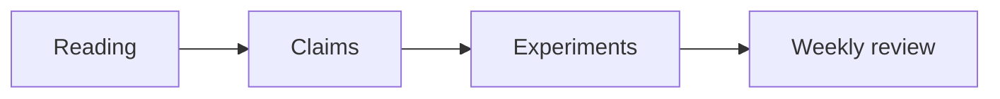

> [!NOTE]
> This weekly log records the starting point of my EE405 FYP1 contribution.

## Focus

The first pass groups the literature into three clusters:

| Cluster | Question | Output |
| --- | --- | --- |
| Retrieval | What evidence is available? | Annotated bibliography |
| Modeling | Which assumptions matter? | Experiment backlog |
| Evaluation | How will claims be tested? | Metrics sheet |

The planning heuristic is:

$$
P = \frac{I \times U}{E + 1}
$$

where impact $I$, uncertainty $U$, and effort $E$ are scored from 1 to 5.

```ts
type ResearchTask = {
  title: string;
  impact: number;
  uncertainty: number;
  effort: number;
};

export function priority(task: ResearchTask) {
  return (task.impact * task.uncertainty) / (task.effort + 1);
}
```



Citation example: structured research logs make project progress easier to review [@knuth1984].
